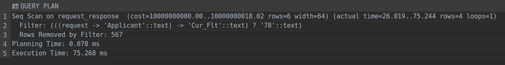

# pgx_and_json_filter
Тестирование работы pgx и json filter в postgresql  
### Задание  
1. Настроить коннект через pgx к postgresql
2. Создать таблицу для хранения request и response
3. Проверить возможность индексирования json полей по ключу
4. Заполнить базу тестовыми данными
5. Проверить возможность поиска по индексу  
6. Оценить эффективность выполнения запросов
### Отчет  
1.  Коннект сделал, запросы либо пишем прямо чистым sql, либо через sql builder(goqu),
либо  через ORM(gorm)
2.  request и response стоит хранить в jsonb поле,
 обычный text не гарантирует валидности json объекта,  
 простое json поле содержит избыточные данные(пробелы и дублирующиеся ключи) и не позволяет индексировать,  
 jsonb эффективнее хранит данные и индексируется  
3.  Индексирование есть, в офф доке написано, что стоит использовать gin индексы(btree и hash не нужно).
   При индексировании поддерживаются операторы ?, ?& , ?|, @>, поэтому =, <>, !=, >, >=, <, <=, in, beetween **не поддерживаются**  
   при созданни следует использовать опцию jsonb_path_ops,
   она уменьшает размер индекса, повышает скорость, но остается только поиск по @>  
4. Заполнил данными из cv_ucl(request, response, 570 строчек)
```sql
create table request_response
(
    guid_transaction uuid default gen_random_uuid() not null,
    guid_strategy    uuid default gen_random_uuid() not null,
    filter           jsonb,
    request          jsonb,
    response         jsonb
);

create unique index request_response_guid_transaction_guid_strategy_uindex
    on request_response (guid_transaction, guid_strategy);
```
5 Создаем индекс на какое-нибудь поле, например на текущий город  
```sql
create index idxgin_cur_city on request_response
    using gin (((request -> 'Applicant' -> 'Cur_City')) JSONB_PATH_OPS);
-- анализируем запрос
explain analyze
select guid_transaction, guid_strategy, request -> 'Applicant' -> 'Cur_City'
from request_response
where (request -> 'Applicant' -> 'Cur_City') ? 'Тольятти';
```

Похожий запрос, но с примененияем индекса по другому пути  
```sql
create index idxgin_appliciant on request_response
    using gin (((request -> 'Applicant')) JSONB_PATH_OPS);
-- анализируем запрос
explain analyze
select guid_transaction, guid_strategy, request -> 'Applicant' -> 'Cur_City'
from request_response
where (request -> 'Applicant') @> '{"Cur_City": ["Тольятти"]}';
```

```sql
explain analyze
select guid_transaction, guid_strategy, request -> 'Applicant' -> 'Cur_City'
from request_response
where (request -> 'Applicant') @> '{"Cur_Flt": ["78"],"Email":["romar02@yandex.ru"]}';
```

6 Без индекса начинает использоваться JIT компиляция,
 около 230ms на запрос, если отключить её, то 75-90ms на запрос
 
 
